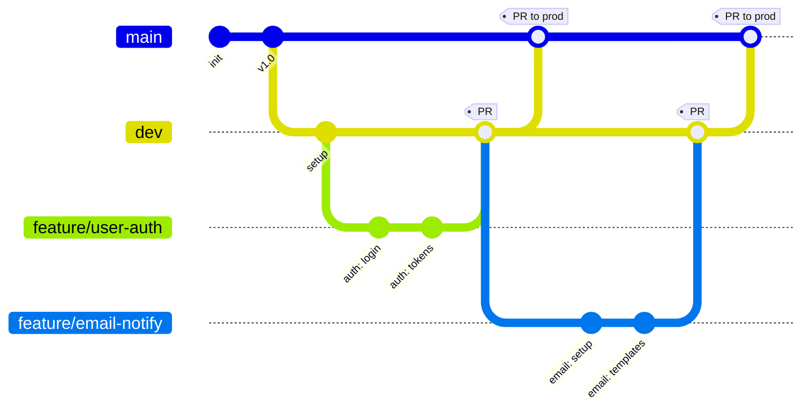

# OrderHub — Git Conventions

This document defines branching strategy, commit message format, and pull request conventions for OrderHub repositories in **Azure DevOps**. It serves as the reference for day-to-day development.


## Core principles

1. **Every project lives in a repository.** No exceptions. If code exists, it belongs in Azure DevOps.
2. **Branch names match environments.** `prod` deploys to production. `dev` deploys to dev. No ambiguity.
3. **No direct pushes to shared branches.** All changes flow through Pull Requests.
4. **Commit early, commit often.** Daily pushes to Azure DevOps. Small, focused commits.
5. **Code review is non-negotiable.** Every PR gets reviewed before merging.

## Why a repository matters

Without proper Git practices, projects suffer:

- **Code loss** — A laptop crash or accidental deletion wipes out work with no recovery
- **Overwriting each other** — Multiple developers on one branch means changes get clobbered
- **No audit trail** — Can't track who changed what, when, or why; debugging becomes guesswork
- **Deployment disasters** — Untested code reaches production with no rollback path

A proper repo provides:

- **Safety net** — Every commit is a checkpoint; code is backed up and recoverable
- **Team collaboration** — Multiple developers work simultaneously without conflicts
- **Full accountability** — Complete audit trail; `git blame` tells the story of every line
- **CI/CD foundation** — Azure DevOps pipelines depend on proper repo structure

## Branching strategy

OrderHub uses **environment-based branching with feature branches**. Two long-lived branches mirror the deployed environments, with short-lived feature branches for each task.

### Branch types

| Branch | Purpose | Lifetime | Direct pushes |
|---|---|---|---|
| `prod` | Production-ready code; deploys to live | Permanent | ❌ Never — PRs only |
| `dev` | Integration & testing; deploys to dev environment | Permanent | ❌ Never — PRs only |
| `feature/*` | Individual tasks or user stories | Short (< 1 week) | ✅ Author's branch |
| `bugfix/*` | Non-urgent bug fixes | Short (< 2 days) | ✅ Author's branch |
| `hotfix/*` | Urgent production fixes | Hours to a day | ✅ Author's branch |
| `refactor/*` | Code improvement without behavior change | Short | ✅ Author's branch |
| `chore/*` | Maintenance, dependencies, tooling | Short | ✅ Author's branch |

### Branch flow

```
feature/*  →  PR  →  dev  →  Test & Validate  →  PR  →  prod
```

Every change follows this path. Feature branches are short-lived workspaces; `dev` is where features integrate and get tested; `prod` is what's running in production.

### How code flows through branches

The visual flow of how multiple feature branches integrate to `dev`, and how `dev` is periodically promoted to `prod`:


- **`prod`** (green) — production. Periodically receives merges from `dev` via PR.
- **`dev`** (blue) — integration. Continuously receives merges from feature branches via PR.
- **`feature/*`** (purple/orange) — short-lived feature branches that fork off `dev` and merge back via PR.
- **`PR merge`** (yellow dashed lines) — every merge between branches goes through a Pull Request.

#### Mermaid version (renders in Azure DevOps Wiki and GitHub)

For a version that renders inline without needing an image file, here's the same flow as a Mermaid `gitGraph`:



> **Note:** Mermaid's `gitGraph` uses `main` as its default base branch name and doesn't currently support renaming it. The diagram above uses `main` for rendering purposes only — in our actual repos, this branch is named `prod`. The PNG diagram above shows the correct branch names (`prod` / `dev` / `feature/*`).

### Why `prod` instead of `main`

Most repositories default to `main` (or older `master`). OrderHub uses `prod` deliberately:

- **Branch names match environments.** Seeing `prod` immediately tells you it's production code
- **Reduces confusion** — `main` is generic; `prod` describes what the branch *does*
- **Consistent naming across Azure DevOps pipelines, environments, and conversations** — when someone says "deploy from prod," there's no ambiguity
- **Self-documenting** — new team members understand the branch purpose without reading docs

### One-time setup: rename `main` → `prod`

For each repo, perform this once:

#### In Azure DevOps web UI

1. **Repos → Branches → `main` → ⋯ → Rename**
   - Rename `main` to `prod`
2. **Project Settings → Repos → Default branch**
   - Set `prod` as the default branch
3. Update any CI/CD pipelines that reference the old branch name

#### Locally

```bash
# Fetch the renamed branch
git fetch origin

# Track the renamed branch
git checkout -b prod origin/prod

# Delete the old local main
git branch -D main
```

### Creating the `dev` branch

After `prod` is set up, create the integration branch:

```bash
git checkout prod
git pull origin prod
git checkout -b dev
git push origin dev
```

Set the same branch protection on `dev` as on `prod` (PRs only, minimum 1 reviewer, build validation).

## Branch naming convention

**Pattern:** `<type>/<short-description>`

```
feature/user-authentication
feature/order-cancellation-api
bugfix/cart-total-calculation
hotfix/security-patch-auth
refactor/extract-payment-service
chore/update-nuget-packages
```

### Naming rules

- **Lowercase, kebab-case** — readable, URL-friendly, consistent with our naming conventions
- **Type prefix matches the work being done** (see table below)
- **Short and descriptive** — recognizable in `git branch` listings, not full sentences
- **Link to Azure DevOps work items when applicable** — `feature/AB#1234-user-auth` enables automatic tracking

### Branch type reference

| Prefix | Example | Use case |
|---|---|---|
| `feature/` | `feature/user-authentication` | New functionality |
| `bugfix/` | `bugfix/cart-total-calculation` | Bug fixes (non-urgent) |
| `hotfix/` | `hotfix/security-patch-auth` | Urgent production fixes |
| `refactor/` | `refactor/extract-payment-service` | Code improvement, no behavior change |
| `chore/` | `chore/update-nuget-packages` | Maintenance tasks, tooling |

## Feature branch lifecycle

The standard flow for any new task:

### 1. Create the branch from `dev`

```bash
git checkout dev
git pull origin dev
git checkout -b feature/my-task
```

Always pull `dev` first to ensure you're branching from the latest code.

### 2. Develop & commit

Write code, commit frequently, push daily:

```bash
git add .
git commit -m "feat: add X"
git push origin feature/my-task
```

Push to Azure DevOps at the end of every session. Don't keep work only on your laptop.

### 3. Open a Pull Request to `dev`

In Azure DevOps:
- **Repos → Pull Requests → New Pull Request**
- Source: `feature/my-task`, Target: `dev`
- Add a clear title and description (link work item)

### 4. Review & merge

- At least 1 reviewer approves
- Build validation passes
- Reviewer or author completes the merge
- **Source branch is deleted** automatically

After merge, your code is in `dev` and will be tested in the dev environment.

## Promoting code: `dev` → `prod`

Production deployments happen by merging `dev` into `prod` via PR.

### When to merge `dev` → `prod`

All these must be true:

- ✅ All feature PRs have been merged to `dev`
- ✅ Dev environment has been tested and validated
- ✅ No known critical bugs in `dev`
- ✅ Team agrees the release is ready

### How to merge

1. Create PR from `dev` → `prod` in Azure DevOps
2. At least 1 reviewer approves
3. Build validation passes
4. Complete the merge
5. Production deployment runs automatically (or trigger manually per pipeline setup)

### Never do this

- ❌ Push directly to `prod` — ever
- ❌ Merge feature branches directly to `prod` (skip `dev`)
- ❌ Skip testing on the dev environment
- ❌ Force push to `dev` or `prod`
- ❌ Leave feature branches open for weeks

## Hotfix strategy

When production breaks and you can't wait for the normal `feature → dev → prod` flow:

### 1. Branch from `prod`

```bash
git checkout prod
git pull origin prod
git checkout -b hotfix/critical-bug
```

Hotfixes branch from `prod`, not `dev`, because you're fixing what's currently in production.

### 2. Fix and test

Make the fix, test locally, commit with a clear message:

```bash
git add .
git commit -m "fix: resolve null reference in payment processing"
git push origin hotfix/critical-bug
```

### 3. PR to `prod`

- Open PR: `hotfix/critical-bug` → `prod`
- Get emergency review (expedite, but still review)
- Merge immediately
- Deploy

### 4. Back-merge to `dev` ⚠️ CRITICAL

```
Open PR: hotfix/critical-bug → dev
Get review and merge
```

**This step is non-negotiable.** If you forget, `dev` and `prod` will drift apart, and the next `dev → prod` merge will reintroduce the bug or cause confusing conflicts.

> 💡 **Always back-merge hotfixes to `dev`.** Set a calendar reminder, write a checklist, do whatever it takes. This is the #1 cause of subtle production bugs reappearing.

## Commit messages

Use the **Conventional Commits** format. Clear commit history makes the codebase navigable.

### Format

```
<type>: <subject>
```

Or with optional scope:

```
<type>(<scope>): <subject>
```

### Commit types

| Type | Use for |
|---|---|
| `feat` | New feature or capability |
| `fix` | Bug fix |
| `refactor` | Code restructuring, no behavior change |
| `perf` | Performance improvement |
| `docs` | Documentation only |
| `style` | Formatting, whitespace (no logic change) |
| `test` | Adding or updating tests |
| `chore` | Tooling, dependencies, build config |

### Good vs. bad examples

| ✅ Good | ❌ Bad |
|---|---|
| `fix: resolve null ref in OrderService` | `fix stuff` |
| `feat: add email notification on signup` | `updated code` |
| `refactor: extract validation logic` | `asdfgh` |
| `feat(orders): add cancellation endpoint` | `WIP` |
| `chore(deps): upgrade FluentValidation to 11.10.0` | `Fixed bug` |

### Rules

- **Imperative mood** — "fix", "add", "update" (not "fixed", "added", "updated")
- **Lowercase after the colon** — `feat: add login`, not `feat: Add login`
- **No period at the end** of the subject line
- **Subject under 72 characters** if possible
- **Use the body** for non-trivial changes — explain *why*, not *what*

### The golden rules

- Commit at least once per day
- Each commit = one logical change
- Write meaningful commit messages
- **Never commit secrets or credentials**
- Push to Azure DevOps after each session

## Pull requests in Azure DevOps

### Keep PRs small

**Aim for 200–400 lines of code changed** (excluding generated files, lock files, migrations).

Smaller PRs get faster, better reviews. Research consistently shows review quality drops sharply past ~400 LOC. Reviewers skim large PRs, miss bugs, and approve to clear the queue.

### PR description: what & why

Every PR should describe:

- **What changed** — short summary
- **Why** — context, link to work item
- **Screenshots** if UI changes
- **Testing** — how was this verified?

#### Suggested PR template

Configure this in Azure DevOps as a default PR description:

```markdown
## What

Brief description of what this PR does.

## Why

Context for the change. Link to Azure DevOps work item: AB#____

## How

Implementation approach, notable decisions.

## Testing

- [ ] Unit tests added/updated
- [ ] Manual testing in dev environment
- [ ] Build validation passes

## Screenshots / Recordings

(For UI changes)

## Checklist

- [ ] Code follows project conventions
- [ ] No secrets committed
- [ ] No console.log / debug code left in
- [ ] Work item linked
```

### Review carefully

- **At least 1 reviewer** required
- Check logic, not just style
- Approve, request changes, or comment
- **Aim to review within one business day** — long review queues kill team velocity

### Reviewer best practices

- **Be specific** — "Extract this into a helper" beats "this could be cleaner"
- **Distinguish blocking from non-blocking** — `nit:` for style preferences, `must:` for blockers
- **Approve if it's a net improvement** — perfect is the enemy of shipped
- **Test locally for non-trivial changes** — don't just read the diff

## Azure DevOps branch policies

Configure these policies on **both `prod` and `dev`** in Azure DevOps:

### Required policies

```
Branch Policies for: prod (and dev)

✅ Require minimum number of reviewers: 1
✅ Reset code reviewer votes when there are new changes
✅ Require linked work items
✅ Build validation
   - Trigger: Automatic
   - Build expiration: 12 hours
✅ Limit merge types
   - Squash merge ✅
   - Other merge types: ❌ (disabled)
✅ Status checks
   - PR build must succeed
✅ Automatically include reviewers (optional, by file path)

❌ No direct pushes to dev or prod
❌ No force pushes
```

### Why squash merge

When merging a feature branch via PR, **squash merge** combines all the feature's commits into a single commit on `dev` (and later on `prod`). This:

- Keeps history on `dev` and `prod` clean — one commit per PR
- Makes reverts easy — `git revert <sha>` removes the entire feature
- Lets developers have messy WIP commits during development without polluting the main branches
- Makes `git log` actually readable

## Essential Git commands

### Daily workflow

```bash
# Start from latest dev
git checkout dev && git pull

# Create feature branch
git checkout -b feature/my-task

# Stage changes
git add .

# Commit with message
git commit -m "feat: add X"

# Push to Azure DevOps
git push origin feature/my-task

# → Create PR in Azure DevOps web UI
# → Request code review
```

### Branch management

```bash
# List local branches
git branch

# Delete a merged local branch
git branch -d feature/done

# Update your feature branch with latest dev
git checkout feature/my-task
git merge dev

# Temporarily save uncommitted work
git stash
# ...do other things...
git stash pop

# View recent commits
git log --oneline -10

# Compare your branch with dev
git diff dev
```

### Hotfix workflow

```bash
# Branch from prod (not dev)
git checkout prod
git pull origin prod
git checkout -b hotfix/critical-bug

# Make fix, test locally
git add .
git commit -m "fix: resolve null reference in payment processing"
git push origin hotfix/critical-bug

# → PR to prod, get expedited review, merge, deploy
# → Then back-merge: PR from hotfix branch to dev
```

## Common pitfalls to avoid

| Pitfall | What to do instead |
|---|---|
| Working on `dev` directly | Always create a feature branch first |
| Huge PRs with 1000+ lines | Break into small, focused PRs (200–400 lines) |
| Not pulling before branching | Always `git pull dev` before creating a new branch |
| Leaving stale branches around | Delete branches after PR is merged |
| Committing once a week with everything | Commit small changes frequently throughout the day |
| Forgetting to sync `dev` after hotfix | Always back-merge hotfixes into `dev` |
| Force pushing to shared branches | Never force-push `dev` or `prod` |
| Committing secrets or credentials | Use `.gitignore`; rotate immediately if leaked |

## Future scaling: release branches

The current `dev → prod` model works perfectly for OrderHub's team size. As projects grow, **release branches** become a useful additive layer.

### What release branches look like

```
dev ─────────────────────────────────────────────► (new features continue)
                       │
                       └── release/1.0 ─────────► prod
                              │ (bug fixes only)
                              └── back-merge to dev
```

A release branch is cut from `dev` when a version is ready to stabilize. Bug fixes happen on the release branch (and are back-merged to `dev`); new features continue on `dev` for the next version.

### When to add release branches

- **Team size grows** and needs to keep shipping new features while stabilizing a release
- **Formal QA cycles** that take days or weeks
- **Versioned releases** (v1.0, v1.1, v2.0) with maintenance support for older versions
- **Multiple production versions** running simultaneously (different customer tiers, etc.)

### Our current approach

For now, **`dev → prod` works perfectly for our team size.** Release branches are an *additive* change — we can layer them on when projects scale up without restructuring anything. Don't add complexity until it's needed.

## Action items for every project

When starting a new repository in Azure DevOps:

1. **Every project gets a repository in Azure DevOps** — no exceptions. If code exists, it belongs in a repo.
2. **Set up `dev` and `prod` branches** with branch policies. No direct pushes — PRs only.
3. **Always create feature branches from `dev`.** Follow the naming convention: `feature/`, `bugfix/`, `hotfix/`.
4. **Commit daily with meaningful messages.** Push to Azure DevOps at end of every session.
5. **Review each other's code via PRs.** This is where we learn, catch bugs, and improve as a team.

## Quick reference cheat sheet

### Branches

```
prod              Production. Deploys to live. PRs only.
dev               Integration. Deploys to dev environment. PRs only.
feature/<name>    New functionality. Branch from dev, PR to dev.
bugfix/<name>     Non-urgent fix. Branch from dev, PR to dev.
hotfix/<name>     Urgent fix. Branch from prod, PR to prod, back-merge to dev.
refactor/<name>   Code improvement. Branch from dev, PR to dev.
chore/<name>      Maintenance. Branch from dev, PR to dev.
```

### Commit format

```
<type>: <subject>

Types: feat, fix, refactor, perf, docs, style, test, chore
```

### Daily flow

```bash
git checkout dev && git pull
git checkout -b feature/my-task
# ...work...
git add . && git commit -m "feat: add X"
git push origin feature/my-task
# → Open PR in Azure DevOps
```

### Hotfix flow

```bash
git checkout prod && git pull
git checkout -b hotfix/critical-bug
# ...fix...
git add . && git commit -m "fix: resolve issue"
git push origin hotfix/critical-bug
# → PR to prod, merge, deploy
# → Open second PR: hotfix branch → dev (back-merge)
```

---

**Last updated:** 2026-04-30
**Owner:** Engineering Team
**Related:**
- [`AZURE_CONVENTIONS.md`](./AZURE_CONVENTIONS.md) — Azure resource naming
- [`DATABASE_CONVENTIONS.md`](./DATABASE_CONVENTIONS.md) — Database object naming
- [`API_CONVENTIONS.md`](./API_CONVENTIONS.md) — REST API conventions
- [`CSHARP_CONVENTIONS.md`](./CSHARP_CONVENTIONS.md) — C# / .NET conventions
- [`NEXTJS_CONVENTIONS.md`](./NEXTJS_CONVENTIONS.md) — Next.js / frontend conventions
